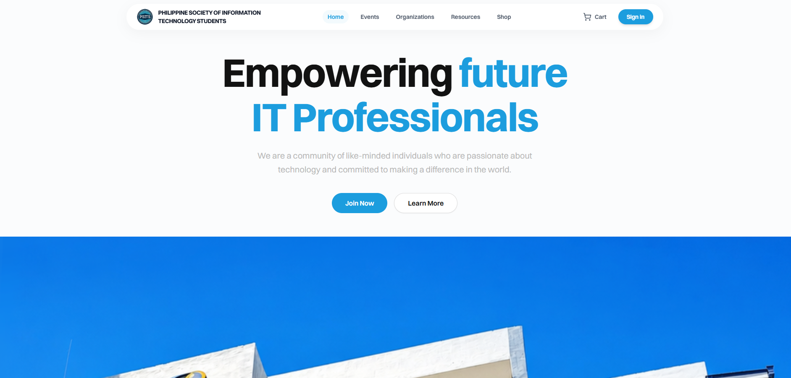

# PSITS | University of Cebu - Main Campus

A comprehensive web platform for the Philippine Society of Information Technology Students (PSITS) at the University of Cebu - Main Campus College of Computer Studies. This application enhances the student experience through merchandise management, event handling, attendance tracking, and community engagement features.

**Website:** https://psits.org  
**Facebook:** https://www.facebook.com/PSITS.UCmain



## 🛠️ Tech Stack


**Frontend:** React + Vite + TailwindCSS  
**Backend:** Node.js + Express + TypeScript  
**Database:** MongoDB  
**Deployment:** Vercel (Frontend), Koyeb + Cloudflare (Backend)

## ✨ Features

- 🛍️ **Merchandise Management** - Browse and purchase PSITS merchandise with inventory tracking
- 📅 **Event Management** - Create, manage, and track organization events
- 🤝 **Recruitment Management** - Create, manage, and track recruitment process
- 📋 **Attendance Tracking** - Record and monitor student attendance at events
- 👥 **Student Profiles** - Manage student memberships and membership requests
- 📚 **Documentation** - Access organization documentation and resources
- 🎯 **Admin Dashboard** - Comprehensive admin panel for managing users, events, merchandise, and orders
- 🎲 **Raffle System** - Organize raffles for events and giveaways
- 💳 **Order Management** - Track merchandise orders and receipts

## 🚀 Getting Started

### Prerequisites

- **Node.js** (v16 or higher)
- **npm** or **yarn** package manager
- **.env file** - Contact a lead developer to obtain the required environment variables

### Installation

1. **Clone the repository**

   ```bash
   git clone <repository-url>
   cd PsitsWeb
   ```

2. **Install Frontend Dependencies**

   ```bash
   cd client-side
   npm install
   ```

3. **Install Backend Dependencies**

   ```bash
   cd ../server-side
   npm install
   ```

4. **Environment Setup**
   - Request `.env` file from a lead developer
   - Place the `.env` file in the `server-side` directory

## 🏃 Running the Project

The project consists of two parts that run independently:

**Frontend Development Server:**

```bash
cd client-side
npm run dev
```

**Backend Development Server:**

```bash
cd server-side
npm run dev
```

Both servers will start in development mode. The frontend will typically run on `http://localhost:5173` and the backend on `http://localhost:3000` (or as configured in your .env file).

## 📖 API Documentation

API documentation is currently being prepared and will be available soon.

## 🤝 Contributing

We welcome contributions! Please review our [CONTRIBUTING.md](./CONTRIBUTING.md) file for guidelines on:

- Naming conventions
- Code standards
- Pull request process
- Development workflow

## 🙌 Contributors

Thanks go to these awesome contributors:

<a href="https://github.com/PSITS-UC-MAIN/PSITS-WEB-REACT/graphs/contributors">

</a>

## 📜 License

This project is licensed under the terms specified in [LICENSE.md](./LICENSE.md).

## 🙋 Support

Feel free to ask any questions, raise problems, and request new features in [Discussions](https://github.com/PSITS-UC-MAIN/PSITS-WEB-REACT/discussions).

## 📱 Build Pipelines

[](https://github.com/PSITS-UC-MAIN/PSITS-WEB-REACT/actions/workflows/client-side-pipeline.yml)

[](https://github.com/PSITS-UC-MAIN/PSITS-WEB-REACT/actions/workflows/server-side-pipeline.yml)
